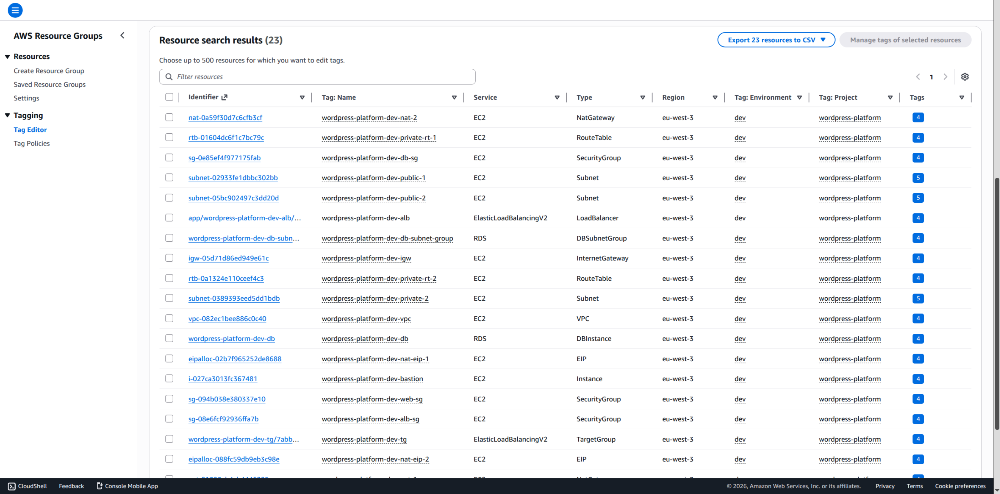
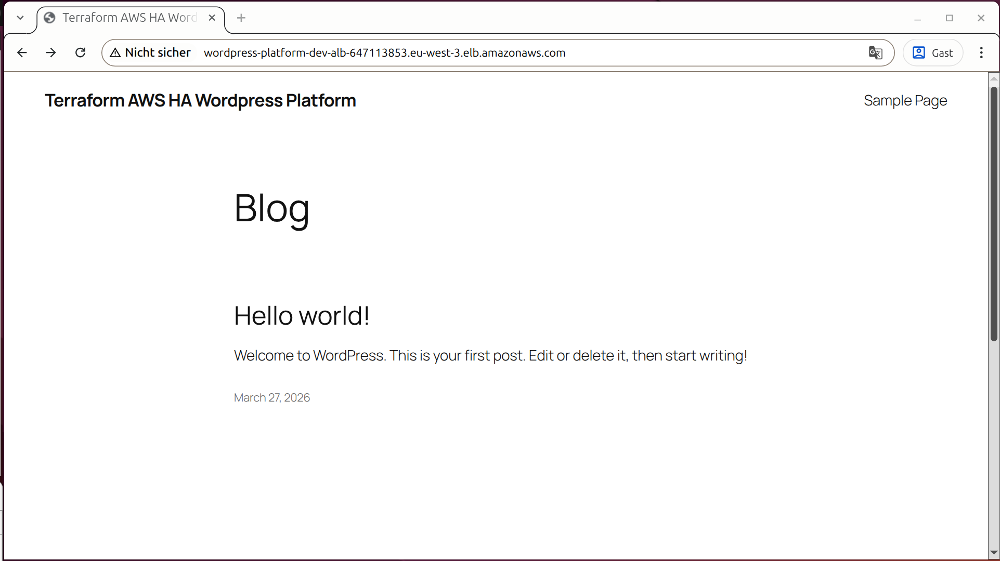
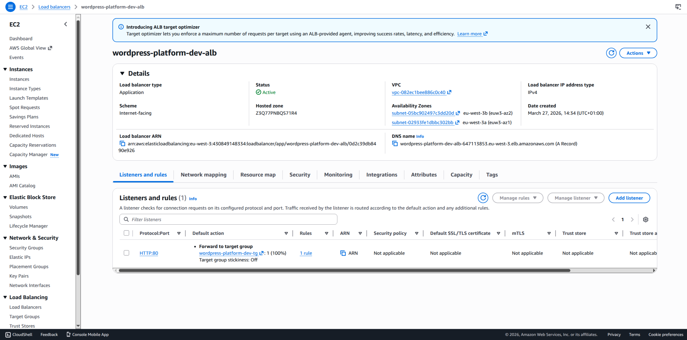
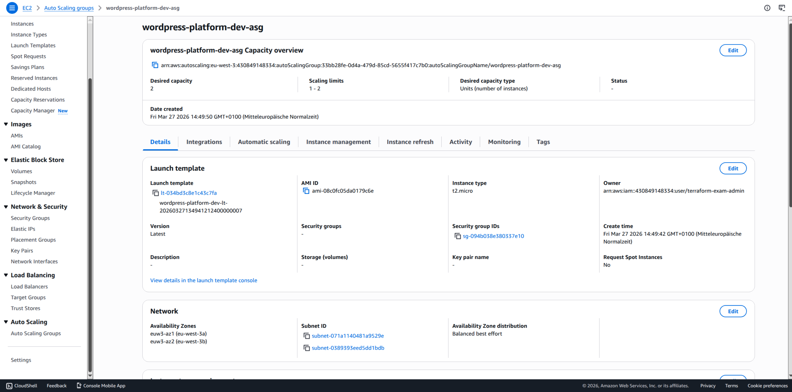
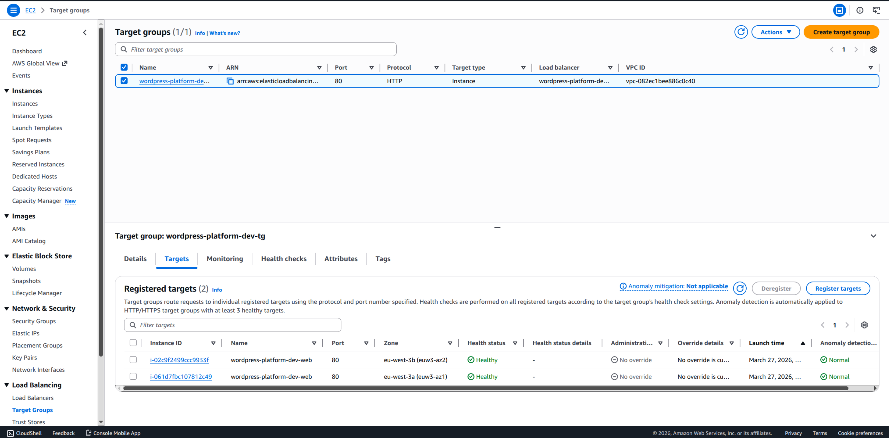
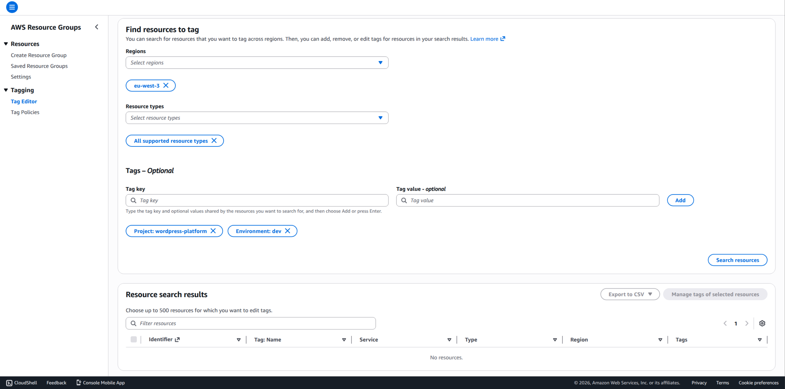

# 🏗️ Highly Available WordPress Platform on AWS with Terraform

### Terraform-based modular AWS infrastructure provisioning • Modular VPC • Multi-AZ networking • Dual NAT gateways • ALB + Auto Scaling web tier • Bastion access • Private RDS • Evidence-backed apply / destroy validation

DevOps / Infrastructure-as-Code project demonstrating how to provision a highly available WordPress platform on AWS with Terraform, using a custom VPC, public/private multi-AZ subnet layout, dual NAT gateways, an Application Load Balancer, an Auto Scaling web tier, a bastion host, and a private Multi-AZ RDS database.

> **Implementation note:** This project focuses on **declarative infrastructure provisioning, validation, and clean teardown**.  
> The stack was successfully created, validated through AWS Console evidence and browser checks/screenshots, and then destroyed again to avoid unnecessary cloud costs.

> **Documentation note:** This repository includes a full supporting documentation set:
> - [docs/SETUP.md](docs/SETUP.md) for local Terraform setup, IAM, AWS CLI, and budget guardrails
> - [docs/RUNBOOK.md](docs/RUNBOOK.md) for the short happy-path execution flow based on Make targets
> - [docs/IMPLEMENTATION.md](docs/IMPLEMENTATION.md) for the detailed build diary, architecture rationale, validation steps, and evidence mapping

---

## 🎯 What this project demonstrates

✅ **Modular Terraform structure** with separate `network`, `database`, `web`, and `bastion` modules  
✅ **Custom VPC** instead of the default VPC, **in order to isolate the platform**, control the addressing scheme explicitly, and keep the infrastructure reproducible  
✅ **Custom CIDR ranges** for the **VPC and all 4 subnets**, **so the network layout is intentional, explicit, and easy to reason about instead of relying on AWS defaults**  
✅ **Public/private subnet design across 2 Availability Zones** for separation of concerns and higher availability  
✅ **Public Application Load Balancer** as the single HTTP entrypoint for the platform  
✅ **Auto Scaling Group** for the WordPress EC2 web servers in the private subnets  
✅ **One NAT Gateway per public subnet**, **matching the high-availability requirement** instead of collapsing private-subnet outbound traffic behind a single NAT gateway  
✅ **Private RDS MySQL deployment** with a DB subnet group and VPC security controls, **so the database is not internet-facing**  
✅ **Restricted bastion host access** for controlled administrative SSH entry into the private environment, **instead of exposing the private web tier directly**  
✅ **Local AWS CLI profile + Terraform workflow** for `plan` / `apply` / `destroy`  
✅ **Cost-aware validation workflow** with AWS Budgets, evidence capture, and immediate teardown

---

## 🧱 Tech Stack

🧱 **Terraform** | ☁️ **AWS** | 🌍 **VPC** | 🐧 **Ubuntu EC2** | 🗄️ **RDS MySQL** | ⚖️ **ALB** | 📈 **Auto Scaling** | 🔐 **IAM** | 🛡️ **Security Groups** | 🧰 **AWS CLI** | 🛠️ **Makefile**

---

## 🏗️ Architecture (high level)

~~~text
Internet
   |
   | HTTP :80
   v
+------------------------------------------------------------------+
| Application Load Balancer (ALB)                                       |
| public subnets (2 AZs) | public entrypoint | DNS: <alb_dns_name> |
+------------------------------------------------------------------+
                                  |
                                  | HTTP :80
                                  v
                     +------------------------------------------+
                     | Auto Scaling Group                       |
                     | 2 WordPress EC2 instances                |
                     | private subnets (2 AZs) | eu-west-3a/b   |
                     +------------------------------------------+
                                          |
                                          | MySQL :3306
                                          v
                     +------------------------------------------+
                     | RDS MySQL (Multi-AZ)                     |
                     | private DB subnet group                  |
                     +------------------------------------------+

Admin / operator
   |
   | SSH :22
   v
+------------------------------------------------------------------+
| Bastion host                                                     |
| public subnet | public IP | restricted by security group         |
+------------------------------------------------------------------+

+------------------------------------------------------------------+
| Custom VPC                                                       |
| CIDR: 10.0.0.0/16                                                |
| - 2 public subnets:                                              |
|   - public-1  10.0.1.0/24  -> IGW                                |
|   - public-2  10.0.2.0/24  -> IGW                                |
| - 2 private subnets:                                             |
|   - private-1 10.0.11.0/24 -> NAT-1                              |
|   - private-2 10.0.12.0/24 -> NAT-2                              |
| - 1 Internet Gateway                                             |
| - 2 NAT Gateways                                                 |
+------------------------------------------------------------------+
~~~

### Notes

- The **ALB** is the **public HTTP entrypoint** for the application.
- The **WordPress web tier / EC2 instances** run in **private subnets** and are **not directly public**.
- The **RDS database** is also **private** and only reachable from inside the VPC.
- The **bastion host** is the **controlled SSH entrypoint** for administrative access.
- The **private subnets use NAT gateways for outbound internet access** without becoming directly public.
---

## 📦 Infrastructure Overview

This repository provisions an AWS-based WordPress platform as code.

### Deployed Stack

The final deployed stack includes:

- **1 custom VPC** in `eu-west-3` / Paris
- **2 public subnets** and **2 private subnets** across `eu-west-3a` and `eu-west-3b`
- **1 Internet Gateway**
- **2 NAT Gateways**
- **1 bastion EC2 instance**
- **1 ALB** with HTTP listener and target group
- **1 Auto Scaling Group** for the WordPress web tier
- **1 Multi-AZ RDS MySQL instance**
- Terraform outputs for the ALB DNS name, DB endpoint, subnet IDs, security groups, and VPC ID

### Deployment Validation

The deployment was validated through:
- Successful Terraform `plan`, `apply`, and `destroy`
- AWS Console screenshots across VPC / EC2 / RDS / Budgets / Tag Editor (see `docs/evidence/aws/...`)
- Browser-based WordPress proof via the ALB DNS name (see `docs/evidence/wp/...`)

---

## 🔄 Implementation Sequence (high level)

1. **AWS access and guardrails prepared**  
   IAM user access, local AWS CLI profile, and AWS Budget alerts were configured first.

2. **Terraform project scaffolded**  
   The repository structure, module layout, variable flow, and Make targets were prepared before real infrastructure work began.

3. **Core infrastructure modules implemented**  
   The network, database, web, and bastion layers were added step by step and validated incrementally with Terraform plans.

4. **Readable plan inspection added**  
   Saved plans, grouped resource summaries, and optional graph/visualization helpers were used to inspect what Terraform was about to create.

5. **Full stack deployed and validated**  
   The AWS stack was applied successfully, inspected in the AWS Console, and verified in the browser through the ALB-hosted WordPress flow.

6. **Evidence captured and stack destroyed**  
   AWS Console and browser proof were collected, then the full stack was destroyed again to end the cost-generating phase.

---

## ✅ DevOps / IaC Scope Implemented

- **Modular Terraform layout** with dedicated **child modules** for:
  - **`network`**
  - **`database`**
  - **`web`**
  - **`bastion`**
- **AWS CLI access** for local Terraform execution
- **Custom CIDR ranges** for the **VPC and all 4 subnets**, because the project uses a dedicated custom VPC instead of AWS defaults
- **Terraform data sources** to select the target **Availability Zones** and **AMI**
- **AWS network foundation**
- **Private Multi-AZ RDS layer**
- **Public ALB** with **target group** and **HTTP listener**
- **Launch template** and **Auto Scaling Group** for the web tier
- **Automatic WordPress bootstrap** through EC2 `user_data`
- **Restricted bastion access path** with **AWS key-pair registration** from the already existing local public SSH key
- **Makefile** for the common **Terraform lifecycle + plan inspection commands**
- **Creation, runtime, and cleanup evidence**
- **Clean full-stack teardown** after validation

---

## 📁 Project Structure

### Repository Tree

~~~bash
.
├── docs/
│   ├── evidence/
│   │   ├── aws/                         # AWS Console screenshots for budgets, VPC, subnets, NAT, RDS, ALB, ASG, instances, target health, and post-destroy proof
│   │   └── wp/                          # Browser screenshots for WordPress load, install wizard, login screen, and rendered sample page
│   ├── IMPLEMENTATION.md                # Full build diary with rationale, commands, observations, and evidence links
│   ├── RUNBOOK.md                       # Short happy-path rerun guide using Make targets as primary entrypoints
│   └── SETUP.md                         # Local setup guide for Terraform, AWS CLI, IAM user, profile, and AWS budget guardrails
├── Makefile                             # Comfy-wrappers for init / validate / plan / apply / destroy / graph helpers
├── main.tf                              # Root module wiring for network, database, bastion, and web
├── providers.tf                         # AWS provider configuration and shared default tags
├── versions.tf                          # Terraform and provider version requirements
├── variables.tf                         # Root input variables for profile, region, DB settings, and instance sizes
├── outputs.tf                           # Root outputs for ALB, DB, VPC, subnets, and security groups
├── terraform.tfvars.example             # Redacted example for local-only runtime values
├── modules/
│   ├── network/                         # Network layer module
│   │   ├── main.tf                      # VPC, subnets, Internet Gateway, NAT Gateways, route tables, and associations
│   │   ├── variables.tf                 # Network module inputs such as naming context and CIDR ranges
│   │   └── outputs.tf                   # Network outputs such as VPC ID, subnet IDs, and selected AZs
│   ├── database/                        # Database layer module
│   │   ├── main.tf                      # DB subnet group, DB security group, and private Multi-AZ RDS instance
│   │   ├── variables.tf                 # Database module inputs such as VPC placement and DB settings
│   │   └── outputs.tf                   # Database outputs such as DB endpoint, port, and DB security group ID
│   ├── web/                             # Web / application layer module
│   │   ├── main.tf                      # ALB, target group, listener, launch template, Auto Scaling Group, and security groups
│   │   ├── variables.tf                 # Web module inputs such as subnet IDs, DB connection data, and instance type
│   │   └── outputs.tf                   # Web outputs such as ALB DNS name, ASG name, and web security group ID
│   └── bastion/                         # Administrative access module
│       ├── main.tf                      # Bastion EC2 instance, AWS key pair, and restricted bastion security group
│       ├── variables.tf                 # Bastion module inputs such as trusted SSH CIDR, key path, and instance type
│       └── outputs.tf                   # Bastion outputs such as public IP and bastion security group ID
└── user_data/
    └── wordpress.sh.tftpl               # Bootstrap template for package install, WordPress download, config generation, and Apache startup
~~~

### Main Buildung Blocks

The final solution centers around 7 main building blocks:

- **(1) Root Terraform composition layer**
  - `main.tf`
  - `providers.tf`
  - `versions.tf`
  - `variables.tf`
  - `outputs.tf`
- **(2) Network module**
  - `modules/network/main.tf`
  - `modules/network/outputs.tf`
  - `modules/network/variables.tf`
- **(3) Database module** 
  - `modules/database/main.tf`
  - `modules/database/outputs.tf`
  - `modules/database/variables.tf`
- **(4) Web module**
  - `modules/web/main.tf`
  - `modules/web/outputs.tf`
  - `modules/web/variables.tf`
- **(5) Bastion module**
  - `modules/bastion/main.tf`
  - `modules/bastion/outputs.tf`
  - `modules/bastion/variables.tf`
- **(6) EC2 bootstrap layer**
  - `user_data/wordpress.sh.tftpl`  
- **(7) Documentation + evidence layer** 
  - `docs/`
  - `docs/evidence/`

---

## ✅ What works - Validated Results

### Functional validation 

- Terraform initializes and validates successfully
- The saved plan shows the intended AWS resource set before apply
- The full stack deploys successfully into AWS with the intended infrastructure resource set (see grouped inventory below)
- WordPress is reachable through the ALB DNS name. 
- The WordPress installation wizard loads successfully in the browser.
- A WordPress sample page is displayed after site setup. 
- AWS Console evidence exists for both creation and destruction phases
- The stack can be destroyed cleanly again after validation via Terraform

### Representative AWS resoucre inventory

`make plan-counts` shows the grouped AWS resource inventory from the reviewed Terraform plan, i.e. the main resource types Terraform intends to create before the first real apply: 

~~~text
1x aws_autoscaling_group
1x aws_db_instance
1x aws_db_subnet_group
2x aws_eip
1x aws_instance
1x aws_internet_gateway
1x aws_key_pair
1x aws_launch_template
1x aws_lb
1x aws_lb_listener
1x aws_lb_target_group
2x aws_nat_gateway
3x aws_route_table
4x aws_route_table_association
4x aws_security_group
4x aws_subnet
1x aws_vpc
~~~

---

## 🔧 Key Engineering Decisions

This project includes a few practical engineering choices worth calling out:

- **Custom VPC instead of the default VPC**  
  The infrastructure is provisioned into a dedicated VPC with explicitly chosen CIDR ranges instead of reusing the AWS default VPC. This makes the network layout reproducible and easier to reason about.

- **Dual NAT design**  
  To provide high-availability, the project uses **one NAT Gateway per public subnet**, instead of collapsing everything behind a single NAT gateway.

- **Private application + database placement**  
  The web tier and RDS layer run in private subnets, while the ALB and bastion remain public-facing. This keeps the public attack surface smaller and helps to structure the traffic flow clearly: 
  - Internet -> Application Load Balancer (ALB)
  - Operator -> Bastion
  - App      -> Database

- **Ephemeral cost-aware validation**  
  The stack is intentionally treated as short-lived cloud infrastructure to keep costs in check - hence the workflow: apply, validate, capture evidence, destroy.

---

## 🧾 Evidence Overview

### Overview

**Evidence captured in `docs/evidence/...` during validation includes:**

- AWS Budgets overview before and after the live validation cycle
- Tag Editor search results after apply and after destroy
- VPC / subnet / NAT gateway screenshots
- RDS database overview and details screenshots
- ALB, target group, Auto Scaling Group, and EC2 instance screenshots
- browser-based WordPress screenshots:
  - initial load
  - installation wizard
  - finished installation
  - login screen
  - rendered sample page

**Representative evidence files captured during validation:**

- `docs/evidence/aws/03-aws-te-resoucre-search-result-after-apply.png`
- `docs/evidence/aws/18-aws-ec2-target-group-targets.png`
- `docs/evidence/aws/21-aws-te-resoucre-search-result-after-destroy.png`
- `docs/evidence/wp/01-wp-successfully-loaded-wp-site.png`
- `docs/evidence/wp/05-wp-successfully-rendered-sample-page.png`

**Additional terminal proof available for the documentation layer includes:**

- successful `make apply`
- successful Terraform outputs after apply
- successful `terraform plan -destroy`
- successful `make destroy`

## 📸 Evidence Highlights

### 1) Provisioned AWS resoucres after `terraform apply` 

*Post-apply proof showing that the AWS stack was provisioned successfully by Terraform (obtained via an AWS Tag Editor search for resoucres carrying the project tag `wordpress-platform`*

### 2) Public WordPress page rendered successfully

*Public proof that the stack was reachable through the load balancer and rendered application content successfully.*

### 3) Application Load Balancer created and exposed as the public entrypoint

*ALB details showing the public entrypoint used to reach the WordPress platform.*

### 4) Auto Scaling Group created for the private web tier

*ASG details proving that the web tier was deployed as an Auto Scaling Group instead of a single standalone EC2 instance.*

### 5) Target group targets registered behind the ALB

*Target-group proof showing that the web instances were registered behind the ALB and were available as application targets during validation.*

### 6) Resource cleanup verified after destroy

*Post-destroy proof showing that the AWS stack was torn down again instead of being left running.*

---

## 🧠 Full Project Documentation 

**Setup guide**  
For the local Terraform setup path, IAM user creation, CLI profile configuration, AWS Budgets guardrail, and tooling prerequisites:
- [docs/SETUP.md](docs/SETUP.md)

**Runbook**  
For the short happy-path rerun guide based on Make targets:
- [docs/RUNBOOK.md](docs/RUNBOOK.md)

**Implementation log**  
For the detailed build diary, rationale, Terraform + AWS concepts, decisions, evidence mapping, and cleanup flow:
- [docs/IMPLEMENTATION.md](docs/IMPLEMENTATION.md)

---

## APPENDIX: Exercise Goal (summary)

**Scenario:**  
Provision a WordPress platform on AWS with Terraform using a modular IaC structure and validate that the deployment works.

**Core requirements covered by the project:**
- AWS region `eu-west-3`
- 1 VPC
- 4 subnets
- NAT gateway in each public subnet
- WordPress web tier on `t2.micro` instances
- Auto Scaling Group with min `1` / max `2`
- Automatic infrastructure lookup where relevant (for example Availability Zones / AMI)
- `aws_db_instance` database layer on `db.t3.micro`
- ALB for public HTTP access
- Bastion host
- Modular Terraform code
- No hardcoded secrets in committed source

**Expected proof / deliverables covered here:**
- Modular Terraform repository
- Successful plan / apply / destroy flow
- AWS Console validation screenshots
- Browser-based WordPress proof
- Reproducible documentation (here delivered in `README.md`, `docs/SETUP.md`, `docs/RUNBOOK.md`, and `docs/IMPLEMENTATION.md`)
